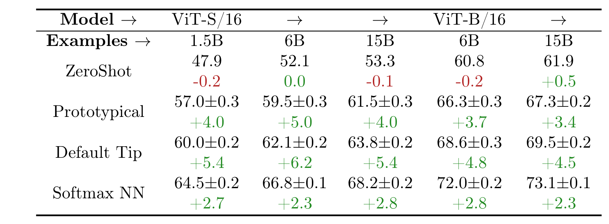

# pubtab

<div align="center">

  

  <p>
    <a href="https://pypi.org/project/pubtab/"></a>
    <a href="https://pypi.org/project/pubtab/"></a>
    
    <a href="https://pypi.org/project/pubtab/"></a>
  </p>

  <strong>Language</strong>: <a href="README.md">English</a> | <a href="README.zh-CN.md">中文</a>

</div>

> 把 Excel 表格转换为出版级 LaTeX，并支持稳定的双向回转（LaTeX ↔ Excel）。

## 亮点

- **回转一致性** — 面向 `tex -> xlsx -> tex` 工作流设计，尽量减少结构漂移。
- **默认全 Sheet 导出** — 未指定 `--sheet` 时，`xlsx2tex` 自动输出全部 `*_sheetNN.tex`。
- **样式高保真** — 保留合并单元格、颜色、富文本、旋转与常见学术表格语义。
- **出版级预览** — 一条命令直接生成 PNG/PDF 结果。
- **Overleaf 友好输出** — 生成的 `.tex` 顶部自动附带注释版 `\usepackage{...}` 提示。

## 示例

<div align="center">
  
  <p><em>pubtab 渲染输出示例：样式和数学表达式均可保留。</em></p>
</div>

### 示例 A：Excel -> LaTeX（全 Sheet）

```bash
pubtab xlsx2tex ./tables/benchmark.xlsx -o ./out/benchmark.tex
```

若工作簿含多个 sheet，输出为：

- `./out/benchmark_sheet01.tex`
- `./out/benchmark_sheet02.tex`
- `...`

### 示例 B：LaTeX -> Excel（多表到多 Sheet）

```bash
pubtab tex2xlsx ./paper/tables.tex -o ./out/tables.xlsx
```

### 示例 C：LaTeX -> PNG / PDF 预览

```bash
pubtab preview ./out/benchmark_sheet01.tex -o ./out/benchmark_sheet01.png --dpi 300
pubtab preview ./out/benchmark_sheet01.tex --format pdf -o ./out/benchmark_sheet01.pdf
```

生成的 `.tex` 顶部会包含注释提示（仅提示，不影响编译）：

```tex
% Theme package hints for this table (add in your preamble):
% \usepackage{booktabs}
% \usepackage{multirow}
% \usepackage[table]{xcolor}
```

## 快速开始

```bash
pip install pubtab
```

### CLI 快速上手

```bash
# 1) Excel -> LaTeX
pubtab xlsx2tex table.xlsx -o table.tex

# 2) LaTeX -> Excel
pubtab tex2xlsx table.tex -o table.xlsx

# 3) 预览
pubtab preview table.tex -o table.png --dpi 300
```

### Python 快速上手

```python
import pubtab

# Excel -> LaTeX
pubtab.xlsx2tex("table.xlsx", output="table.tex", theme="three_line")

# LaTeX -> Excel
pubtab.tex_to_excel("table.tex", "table.xlsx")

# 预览（默认输出 .png）
pubtab.preview("table.tex", dpi=300)
```

## 参数说明（Parameter Guide）

### `pubtab xlsx2tex`

| 参数 | 类型 / 取值 | 默认值 | 含义 | 常见场景 |
|---|---|---|---|---|
| `INPUT_FILE` | 路径（文件或目录） | 必填 | 输入 `.xlsx` / `.xls` 文件，或包含它们的目录 | 主输入 / 批量转换 |
| `-o, --output` | 路径 | 必填 | 输出 `.tex` 路径（多 sheet 会生成 `*_sheetNN.tex`） | 指定输出目录 |
| `-c, --config` | 路径 | 无 | YAML 配置文件 | 团队统一配置 |
| `--sheet` | sheet 名 / 0 起始索引 | 全部 sheet | 仅导出指定 sheet | 单 sheet 调试 |
| `--theme` | 字符串 | `three_line` | 渲染主题 | 切换样式 |
| `--caption` | 字符串 | 无 | 表格标题 | 论文排版 |
| `--label` | 字符串 | 无 | LaTeX 标签 | 交叉引用 |
| `--header-rows` | 整数 | 自动识别 | 表头行数 | 覆盖自动识别 |
| `--span-columns` | 开关 | `false` | 使用 `table*` | 双栏论文 |
| `--preview` | 开关 | `false` | 同步生成 PNG 预览 | 快速肉眼检查 |
| `--position` | 字符串 | `htbp` | 浮动位置参数 | 微调版式 |
| `--font-size` | 字符串 | 主题默认 | 表格字号 | 压缩宽表 |
| `--resizebox` | 字符串 | 无 | 包裹 `\resizebox{...}{!}{...}` | 超宽表格 |
| `--col-spec` | 字符串 | 自动 | 指定列格式 | 手动控制对齐 |
| `--dpi` | 整数 | `300` | 预览 DPI（配合 `--preview`） | 高清输出 |
| `--header-sep` | 字符串 | 自动 | 自定义表头分隔线 | 自定义线条 |
| `--upright-scripts` | 开关 | `false` | 上下标使用直立 `\mathrm{}` | 公式排版偏好 |

### `pubtab tex2xlsx`

| 参数 | 类型 / 取值 | 默认值 | 含义 | 常见场景 |
|---|---|---|---|---|
| `INPUT_FILE` | 路径（文件或目录） | 必填 | 输入 `.tex` 文件，或包含 `.tex` 的目录 | 主输入 / 批量转换 |
| `-o, --output` | 路径 | 必填 | 输出 `.xlsx` 文件 | 导出工作簿 |

### `pubtab preview`

| 参数 | 类型 / 取值 | 默认值 | 含义 | 常见场景 |
|---|---|---|---|---|
| `TEX_FILE` | 路径（文件或目录） | 必填 | 输入 `.tex` 文件，或包含 `.tex` 的目录 | 主输入 / 批量转换 |
| `-o, --output` | 路径 | 按扩展名自动推断 | 输出路径 | 指定文件名 |
| `--theme` | 字符串 | `three_line` | 编译时使用的主题包集合 | 对齐渲染主题 |
| `--dpi` | 整数 | `300` | PNG 分辨率 | 提升清晰度 |
| `--format` | `png` / `pdf` | `png` | 输出格式 | 论文资产导出 |
| `--preamble` | 字符串 | 无 | 额外 LaTeX preamble | 自定义宏 |

### 常用命令组合

```bash
# 默认导出所有 sheet
pubtab xlsx2tex report.xlsx -o out/report.tex

# 仅导出指定 sheet
pubtab xlsx2tex report.xlsx -o out/report.tex --sheet "Main"

# 双栏表 + 预览
pubtab xlsx2tex report.xlsx -o out/report.tex --span-columns --preview --dpi 300
```

## 按工作流理解功能（Features by Workflow）

### 1) Excel -> LaTeX

- 支持 `.xlsx`（openpyxl）与 `.xls`（xlrd），通过 Jinja2 主题渲染 LaTeX。
- 保留富样式：合并单元格、颜色、粗斜体下划线、旋转、diagbox、多行文本。
- 提供表级逻辑：表头分隔线自动生成、section/group 分隔、尾部空列裁剪。
- 默认全 sheet 导出，命名规则稳定为 `*_sheetNN`。

### 2) LaTeX -> Excel

- 单个 `.tex` 中多个表格可解析并写入多个 worksheet。
- 解析 `\multicolumn`、`\multirow`、`\textcolor`、`\cellcolor`、`\rowcolor`、`\diagbox`、`\rotatebox` 等常见命令。
- 支持 `\newcommand` / `\renewcommand` 宏展开与 `\definecolor` 颜色解析。
- 对转义分隔符与嵌套包装场景做了稳健拆分处理。

### 3) 预览管线（Preview Pipeline）

- `pubtab preview` 可把 `.tex` 直接编译为 PNG/PDF。
- 若系统缺少 `pdflatex`，可通过 TinyTeX 自动安装补齐编译环境。
- PNG 优先使用 `pdf2image`，并有平台级后备路径。

## 配置文件（Configuration）

可使用 YAML 固化默认参数；命令行参数优先级高于配置文件。

```yaml
theme: three_line
caption: "Experimental Results"
label: "tab:results"
header_rows: 2
sheet: null
span_columns: false
position: htbp
font_size: footnotesize
resizebox: null
col_spec: null
header_sep: null
preview: false
dpi: 300
spacing:
  tabcolsep: "4pt"
  arraystretch: "1.2"
group_separators: [3, 6]
```

```bash
pubtab xlsx2tex table.xlsx -o output.tex -c config.yaml
```

## 主题系统（Theme System）

pubtab 采用 Jinja2 主题系统。内置 `three_line` 面向学术场景的 booktabs 风格。

自定义主题目录：

```text
my_theme/
├── config.yaml    # packages, spacing, font_size, caption_position
└── template.tex   # Jinja2 template
```

查看可用主题：

```bash
pubtab themes
```

## 项目结构

<details>
<summary>查看项目结构</summary>

```text
pubtab/
├── pyproject.toml
├── README.md
├── README.zh-CN.md
├── LICENSE
└── src/pubtab/
    ├── __init__.py        # 公共 API：xlsx2tex, preview, tex_to_excel
    ├── cli.py             # 命令行（click）
    ├── models.py          # 数据模型
    ├── reader.py          # Excel 读取器（.xlsx/.xls）
    ├── renderer.py        # LaTeX 渲染引擎（Jinja2）
    ├── tex_reader.py      # LaTeX 解析器（tex -> TableData）
    ├── writer.py          # Excel 写入器
    ├── _preview.py        # PNG/PDF 预览辅助
    ├── config.py          # YAML 配置加载
    ├── utils.py           # 转义与颜色工具
    └── themes/
        └── three_line/
            ├── config.yaml
            └── template.tex
```

</details>

## 贡献

欢迎在 [GitHub](https://github.com/Galaxy-Dawn/pubtab) 提交 Issue 和 Pull Request。

## 许可证

[MIT](LICENSE)
