# pubtab

<div align="center">

  

  <p>
    <a href="https://pypi.org/project/pubtab/"></a>
    <a href="https://pypi.org/project/pubtab/"></a>
    
    <a href="https://pypi.org/project/pubtab/"></a>
  </p>

  <strong>Language</strong>: <a href="README.md">English</a> | <a href="README.zh-CN.md">中文</a>

</div>

> 把 Excel 表格转换为出版级 LaTeX，并支持稳定的双向回转（LaTeX ↔ Excel）。

## 亮点

- **回转一致性** — 面向 `tex -> xlsx -> tex` 工作流设计，尽量减少结构漂移。
- **多 TeX backend 支持** — 同时支持经典 `tabular` 导出与 `tabularray` / `tblr` 输出。
- **默认全 Sheet 导出** — 未指定 `--sheet` 时，`xlsx2tex` 自动输出全部 `*_sheetNN.tex`。
- **样式高保真** — 保留合并单元格、颜色、富文本、旋转与常见学术表格语义。
- **出版级预览** — 一条命令直接生成 PNG/PDF 结果。
- **Overleaf 友好输出** — 生成的 `.tex` 顶部自动附带注释版 `\usepackage{...}` 提示。

## Recent News

- **2026-03-18**: `tabularray` backend 支持与 README 刷新 —— 为 `xlsx2tex` 增加 `tabularray` 作为可选 TeX backend，更新 theme/backend 解析逻辑，使 `three_line` 在渲染与预览阶段都能一致使用，把 README 中的示例路径替换为仓库真实存在的 `examples/` 样例，补充 GitHub dev 版本安装命令，并将仓库中的 `tests` 目录从跟踪树中移除。
- **2026-03-06**: 预览依赖恢复与 resizebox 控制增强 —— 改进 TinyTeX / 缺失宏包自动恢复流程，并补充 `resizebox` 相关 CLI 选项，提升宽表导出的可控性。
- **2026-03-05**: 面向 PyPI 的 README 清理与发布准备 —— 将 README 链接切换为 PyPI-safe 形式，并完成 1.0.1 发布流程准备。

## 示例

### 精选展示

<p align="center">
  <a href="examples/table4.xlsx">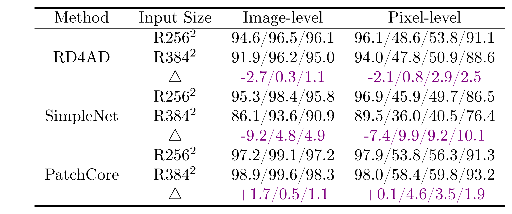</a>
  <a href="examples/table7.xlsx">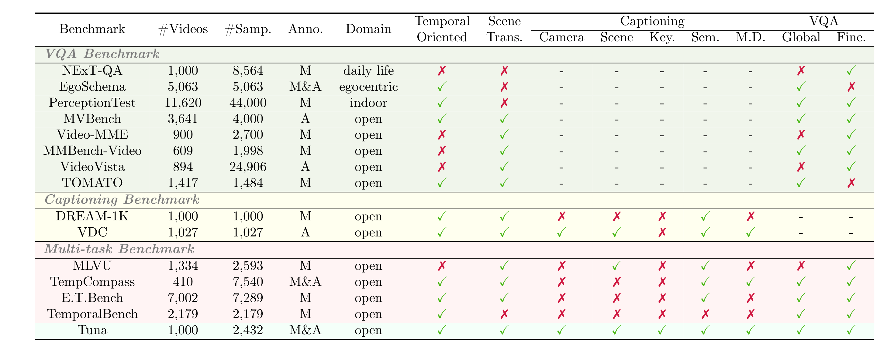</a>
</p>
<p align="center">
  <a href="examples/table8.xlsx">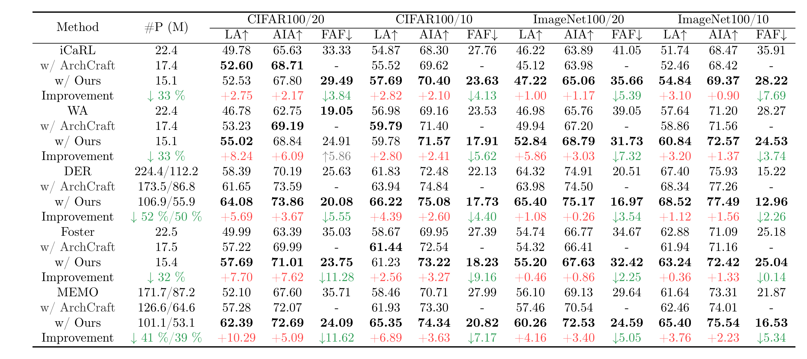</a>
  <a href="examples/table10.xlsx">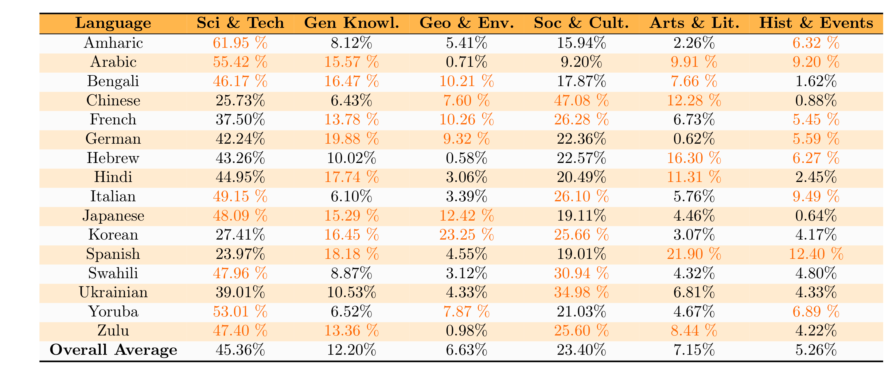</a>
</p>

<details>
<summary><strong>完整图库（11 个示例）</strong></summary>

<p align="center">
  <a href="examples/table1.xlsx">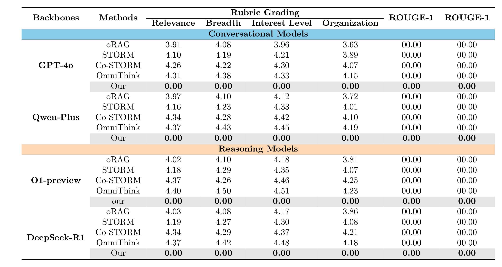</a>
  <a href="examples/table2.xlsx">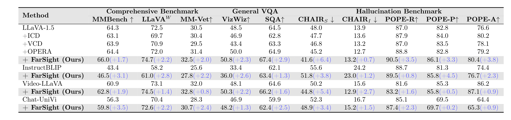</a>
  <a href="examples/table3.xlsx">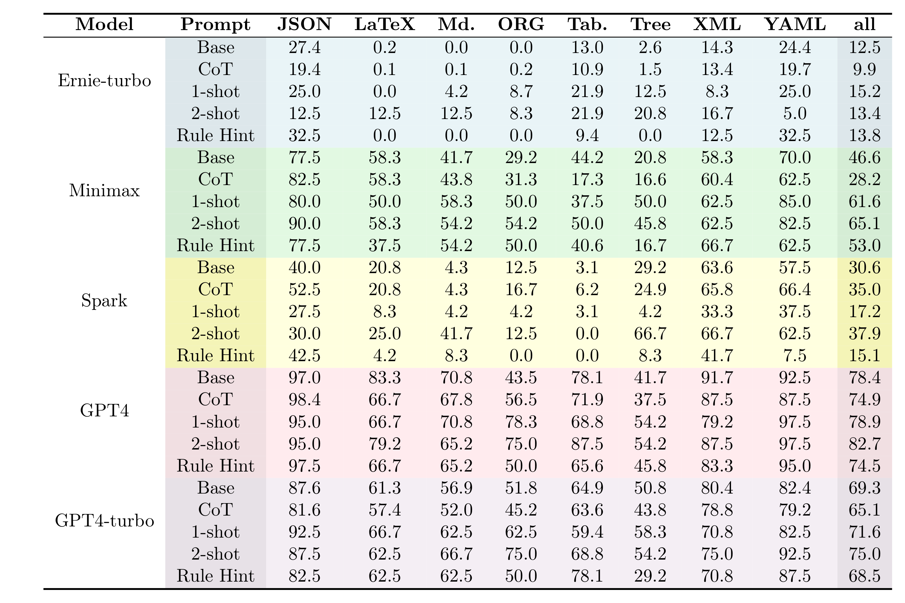</a>
</p>
<p align="center">
  <a href="examples/table4.xlsx"></a>
  <a href="examples/table5.xlsx">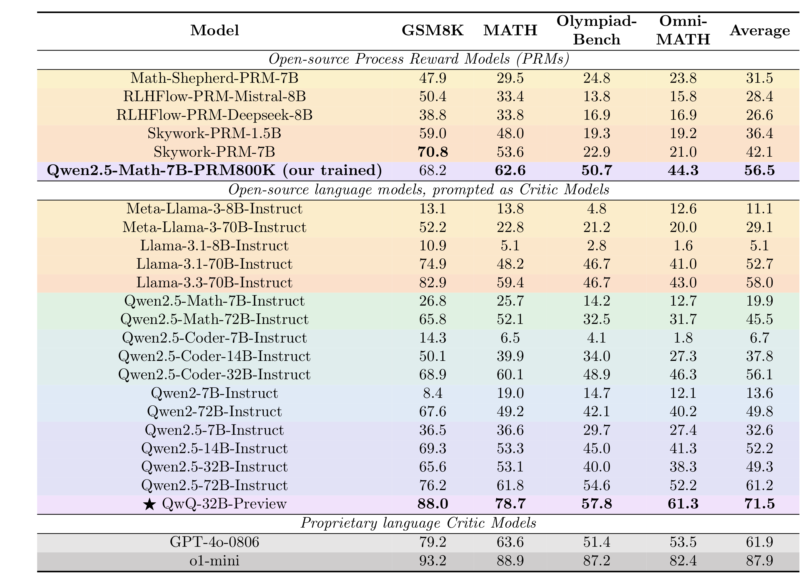</a>
  <a href="examples/table6.xlsx">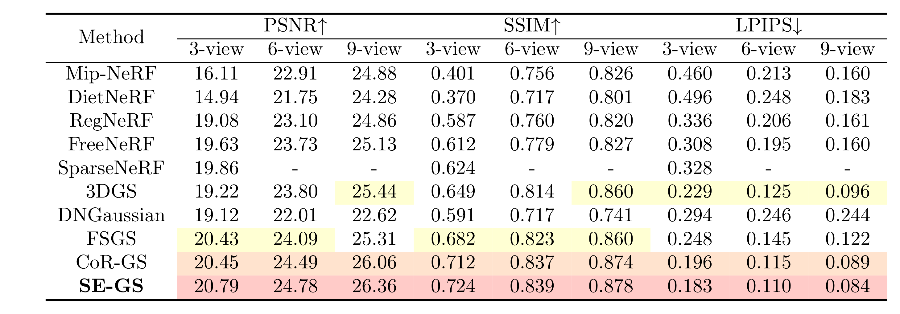</a>
</p>
<p align="center">
  <a href="examples/table7.xlsx"></a>
  <a href="examples/table8.xlsx"></a>
  <a href="examples/table9.xlsx">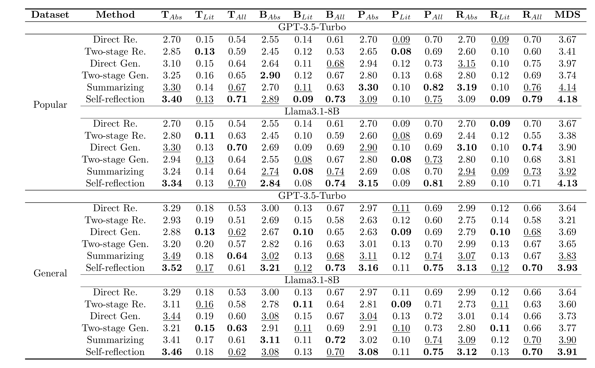</a>
</p>
<p align="center">
  <a href="examples/table10.xlsx"></a>
  <a href="examples/table11.xlsx">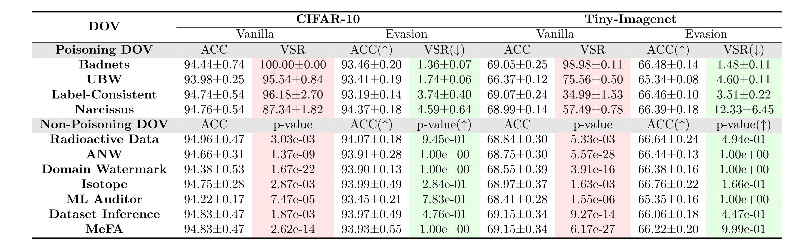</a>
</p>

</details>

### 示例 A：Excel -> LaTeX

```bash
pubtab xlsx2tex ./examples/table4.xlsx -o ./out/table4.tex
```

输出文件：

- `./out/table4.tex`

### 示例 B：LaTeX -> Excel（基于生成结果做 roundtrip）

```bash
pubtab tex2xlsx ./out/table4.tex -o ./out/table4_roundtrip.xlsx
```

### 示例 C：LaTeX -> PNG / PDF 预览

```bash
pubtab preview ./out/table4.tex -o ./out/table4.png --dpi 300
pubtab preview ./out/table4.tex --format pdf -o ./out/table4.pdf
```

### 示例 D：Excel -> tabularray (`tblr`)

```bash
pubtab xlsx2tex ./examples/table4.xlsx -o ./out/table4_tblr.tex \
  --theme three_line \
  --latex-backend tabularray

# 预览生成后的 tabularray tex 文件
pubtab preview ./out/table4_tblr.tex -o ./out/table4_tblr.png \
  --theme three_line --latex-backend tabularray --dpi 300
```

生成的 `.tex` 顶部会包含注释提示（仅提示，不影响编译）：

```tex
% Theme package hints for this table (add in your preamble):
% \usepackage{booktabs}
% \usepackage{multirow}
% \usepackage[table]{xcolor}
```

## 快速开始

```bash
pip install pubtab
```

PyPI 稳定版：[pubtab on PyPI](https://pypi.org/project/pubtab/)

安装当前 GitHub 开发版：

```bash
pip install "git+https://github.com/Galaxy-Dawn/pubtab.git"
```

### CLI 快速上手

```bash
# 1) Excel -> LaTeX
pubtab xlsx2tex table.xlsx -o table.tex

# 2) LaTeX -> Excel
pubtab tex2xlsx table.tex -o table.xlsx

# 3) 预览
pubtab preview table.tex -o table.png --dpi 300

# 4) 原生批量流程（目录输入）
pubtab tex2xlsx ./tables_tex -o ./out/xlsx
pubtab xlsx2tex ./out/xlsx -o ./out/tex
pubtab preview ./out/tex -o ./out/png --format png --dpi 300
```

### Python 快速上手

```python
import pubtab

# Excel -> LaTeX
pubtab.xlsx2tex("table.xlsx", output="table.tex", theme="three_line")

# Excel -> tabularray
pubtab.xlsx2tex(
    "table.xlsx",
    output="table_tblr.tex",
    theme="three_line",
    latex_backend="tabularray",
)

# LaTeX -> Excel
pubtab.tex_to_excel("table.tex", "table.xlsx")

# 预览（默认输出 .png）
pubtab.preview("table.tex", dpi=300)

# 原生批量流程（目录输入）
pubtab.tex_to_excel("tables_tex", "out/xlsx")
pubtab.xlsx2tex("out/xlsx", output="out/tex")
pubtab.preview("out/tex", output="out/png", format="png", dpi=300)
```

## 参数说明

### `pubtab xlsx2tex`

| 参数 | 类型 / 取值 | 默认值 | 含义 | 常见场景 |
|---|---|---|---|---|
| `INPUT_FILE` | 路径（文件或目录） | 必填 | 输入 `.xlsx` / `.xls` 文件，或包含它们的目录 | 主输入 / 批量转换 |
| `-o, --output` | 路径 | 必填 | 输出 `.tex` 文件路径或输出目录；当 `INPUT_FILE` 为目录时，此项必须是目录 | 指定输出位置 |
| `-c, --config` | 路径 | 无 | YAML 配置文件 | 团队统一配置 |
| `--sheet` | sheet 名 / 0 起始索引 | 全部 sheet | 仅导出指定 sheet | 单 sheet 调试 |
| `--theme` | 字符串 | `three_line` | 渲染使用的样式主题 | 切换视觉风格 |
| `--caption` | 字符串 | 无 | 表格标题 | 论文排版 |
| `--label` | 字符串 | 无 | LaTeX 标签 | 交叉引用 |
| `--header-rows` | 整数 | 自动识别 | 表头行数 | 覆盖自动识别 |
| `--span-columns` | 开关 | `false` | 使用 `table*` | 双栏论文 |
| `--preview` | 开关 | `false` | 同步生成 PNG 预览 | 快速肉眼检查 |
| `--position` | 字符串 | `htbp` | 浮动位置参数 | 微调版式 |
| `--font-size` | 字符串 | 主题默认 | 表格字号 | 压缩宽表 |
| `--resizebox` | 字符串 | 无 | 包裹 `\resizebox{...}{!}{...}` | 超宽表格 |
| `--with-resizebox` | 开关 | `false` | 启用 `\resizebox` 包裹 | 强制宽度控制 |
| `--without-resizebox` | 开关 | `false` | 禁用 `\resizebox` 包裹 | 保持原始宽度 |
| `--resizebox-width` | 字符串 | `\linewidth` | `--with-resizebox` 使用的宽度 | 自定义缩放宽度 |
| `--col-spec` | 字符串 | 自动 | 指定列格式 | 手动控制对齐 |
| `--dpi` | 整数 | `300` | 预览 DPI（配合 `--preview`） | 高清输出 |
| `--header-sep` | 字符串 | 自动 | 自定义表头分隔线 | 自定义线条 |
| `--upright-scripts` | 开关 | `false` | 上下标使用直立 `\mathrm{}` | 公式排版偏好 |
| `--latex-backend` | `tabular` / `tabularray` | `tabular` | 渲染使用的 TeX backend | 在 `tabular` 与 `tblr` 间切换 |

### `pubtab tex2xlsx`

| 参数 | 类型 / 取值 | 默认值 | 含义 | 常见场景 |
|---|---|---|---|---|
| `INPUT_FILE` | 路径（文件或目录） | 必填 | 输入 `.tex` 文件，或包含 `.tex` 的目录 | 主输入 / 批量转换 |
| `-o, --output` | 路径 | 必填 | 输出 `.xlsx` 文件路径或输出目录；当 `INPUT_FILE` 为目录时，此项必须是目录 | 导出工作簿 |

### `pubtab preview`

| 参数 | 类型 / 取值 | 默认值 | 含义 | 常见场景 |
|---|---|---|---|---|
| `TEX_FILE` | 路径（文件或目录） | 必填 | 输入 `.tex` 文件，或包含 `.tex` 的目录 | 主输入 / 批量转换 |
| `-o, --output` | 路径 | 按扩展名自动推断 | 输出文件路径或输出目录；当 `TEX_FILE` 为目录时，此项必须是目录 | 指定输出名称 |
| `--theme` | 字符串 | `three_line` | 预览文档组装时使用的样式主题 | 对齐渲染风格 |
| `--latex-backend` | `tabular` / `tabularray` | 自动 | 预览文档组装时使用的 TeX backend | 显式指定或自动识别 `tblr` |
| `--dpi` | 整数 | `300` | PNG 分辨率 | 提升清晰度 |
| `--format` | `png` / `pdf` | `png` | 输出格式 | 论文资产导出 |
| `--preamble` | 字符串 | 无 | 额外 LaTeX preamble | 自定义宏 |

### 常用命令组合

```bash
# 默认导出所有 sheet
pubtab xlsx2tex report.xlsx -o out/report.tex

# 仅导出指定 sheet
pubtab xlsx2tex report.xlsx -o out/report.tex --sheet "Main"

# 双栏表 + 预览
pubtab xlsx2tex report.xlsx -o out/report.tex --span-columns --preview --dpi 300

# 使用 tabularray backend 导出
pubtab xlsx2tex report.xlsx -o out/report_tblr.tex --latex-backend tabularray

# 预览生成后的 tabularray 表格
pubtab preview out/report_tblr.tex -o out/report_tblr.png --theme three_line --latex-backend tabularray --dpi 300
```

## 按工作流理解功能（Features by Workflow）

### 1) Excel -> LaTeX

- 支持 `.xlsx`（openpyxl）与 `.xls`（xlrd），通过 Jinja2 主题渲染 LaTeX。
- 保留富样式：合并单元格、颜色、粗斜体下划线、旋转、diagbox、多行文本。
- 提供表级逻辑：表头分隔线自动生成、section/group 分隔、尾部空列裁剪。
- 默认全 sheet 导出，命名规则稳定为 `*_sheetNN`。

### 2) LaTeX -> Excel

- 单个 `.tex` 中多个表格可解析并写入多个 worksheet。
- 解析 `\multicolumn`、`\multirow`、`\textcolor`、`\cellcolor`、`\rowcolor`、`\diagbox`、`\rotatebox` 等常见命令。
- 支持 `\newcommand` / `\renewcommand` 宏展开与 `\definecolor` 颜色解析。
- 对转义分隔符与嵌套包装场景做了稳健拆分处理。

### 3) 预览管线（Preview Pipeline）

- `pubtab preview` 可把 `.tex` 直接编译为 PNG/PDF。
- 若系统缺少 `pdflatex`，可通过 TinyTeX 自动安装补齐编译环境。
- 若编译日志出现缺失 `.sty`，pubtab 会解析缺失项并尝试执行 `tlmgr install <package>` 后自动重试。
- TinyTeX 下载流程已增强证书兼容性；证书失败时会输出可执行的排查建议。
- 默认 `pip install pubtab` 后即可使用 PNG 预览（内置 `pdf2image` + PyMuPDF 双后端）。

## 配置文件（Configuration）

可使用 YAML 固化默认参数；命令行参数优先级高于配置文件。

```yaml
theme: three_line
latex_backend: tabularray
caption: "Experimental Results"
label: "tab:results"
header_rows: 2
sheet: null
span_columns: false
position: htbp
font_size: footnotesize
resizebox: null
col_spec: null
header_sep: null
preview: false
dpi: 300
spacing:
  tabcolsep: "4pt"
  arraystretch: "1.2"
group_separators: [3, 6]
```

```bash
pubtab xlsx2tex table.xlsx -o output.tex -c config.yaml
```

推荐的 backend 搭配：

- `theme: three_line` + `latex_backend: tabular` -> 经典 `tabular`
- `theme: three_line` + `latex_backend: tabularray` -> 使用 `three_line` 风格，通过 `tabularray` backend 渲染

## 主题系统（Theme System）

pubtab 采用 Jinja2 主题系统。内置 `three_line` 面向学术场景的 booktabs 风格，并可通过经典 `tabular` backend 或 `tabularray` backend 渲染。

自定义主题目录：

```text
my_theme/
├── config.yaml    # packages, spacing, font_size, caption_position
└── template.tex   # Jinja2 template
```

查看可用主题：

```bash
pubtab themes
```

## 项目结构

<details>
<summary>查看项目结构</summary>

```text
pubtab/
├── pyproject.toml
├── README.md
├── README.zh-CN.md
├── LICENSE
└── src/pubtab/
    ├── __init__.py        # 公共 API：xlsx2tex, preview, tex_to_excel
    ├── cli.py             # 命令行（click）
    ├── models.py          # 数据模型
    ├── reader.py          # Excel 读取器（.xlsx/.xls）
    ├── renderer.py        # LaTeX 渲染引擎（Jinja2）
    ├── tex_reader.py      # LaTeX 解析器（tex -> TableData）
    ├── writer.py          # Excel 写入器
    ├── _preview.py        # PNG/PDF 预览辅助
    ├── config.py          # YAML 配置加载
    ├── utils.py           # 转义与颜色工具
    └── themes/
        └── three_line/
            ├── config.yaml
            └── template.tex
```

</details>

## 参考

- 测试数据中参考了 [Azhizhi_akeyan](https://github.com/longkaifang/Azhizhi_akeyan) 仓库中的部分 `.tex` 文件。

## 贡献

欢迎在 [GitHub](https://github.com/Galaxy-Dawn/pubtab) 提交 Issue 和 Pull Request。

## 许可证

[MIT](LICENSE)
